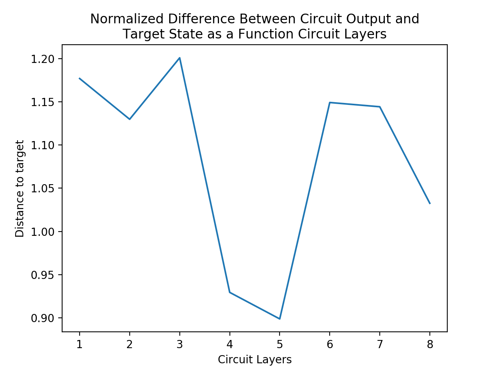

# Task 1
## Approach
I chose to undertake task 1, attempting to find a parameter set on the defined
circuit to make the end state as close as possible to an arbitrary vector. This
problem ended up being quite challenging, mainly in the optimization problem
presented. It is convex is the result of the circuit, given that from the result
we just take the L2 norm with the desired state. Despite this, it is not well
behaved as a function of the input angle parameters.

I built functions to establish even and odd blocks individually, and then a
function to compile the entire circuit in Cirq, given the proper amount of angle
parameters. An example of a two layer circuit:

My go-to method for solving this problem was using more advanced optimization
techniques provided by the `scipy.optimize` library. I initialized the state
randomly, as this is generally a good approach to optimization problems. While
testing, I found large variations in epsilon as a function of the number of
layer. I did a quick gut-check with a custom grid search, and found better
values easily. 

From these investigations, I decided to run the optimizer on several random
initiations to allow more of the parameter space to be explored. It should be
noted that grid search with even a single layer cannot be executed with great
resolution, since it makes `(# of parameters)^(# of steps)` calls to the
objective function (the number of parameters is a eight times the number of
layers, this gets really big really quickly).

## Results
I let calls to `scipy.optimize.minimize()` run for a few hours, and generated
the following plot:

Some of the results seem counter-intuitive, but I will run through them:
- First, all of the results are clustered around 1. This makes sense. Four
  qubits implies that we are working in a 16 dimensional space. The trend
  towards one is a well documented paradox in linear algebra as the number of
  dimensions increases (see
  [here](https://www.cs.cmu.edu/~venkatg/teaching/CStheory-infoage/chap1-high-dim-space.pdf)
  for example).
- There is no discernable trend. This is is confusing at first glance, since we
  are adding extra parameters over which we can optimize with each layer of the
  circuit. However with no way to change the effects of the CZ gates (we can't
  pick a set of angles that turns a layer into the identity) there is a
  possibility that the introduction of extra parameters actually hurts our
  optimization efforts.

That being said, I believe with optimization techniques better suited to the
problem, a more cohesive trend in the distance may emerge. It may have been
possible to explicitly express each part of the circuit in matrix form, and then
optimize directly via gradient descent and linear algebra. This would have been
extremely tedious and would not have scaled easily to a larger number of qubits.
Additionally, I do not believe such a clean solution exists, or my results with
`scipy` would have been nicer.

## Further Considerations
This was my first time actually simulating such large quantum circuits. It was
also my first time considering a quantum optimization problem. I'd be very
interested in learning more about optimization techniques that would help solve
problems like this. Thank you for taking the time to read this.

